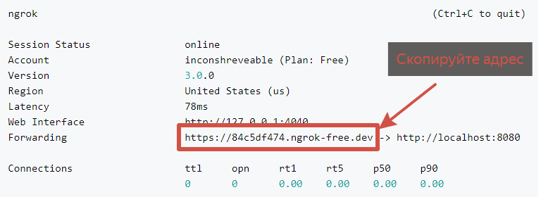

# Calorizator
Telegram-бот для подсчёта калорий с удобными дополнениями (статистика, таймер, учёт продуктов).

[Ссылка](https://t.me/DailyCaloriesCountBot) на бота

<!--Блок информации о репозитории в бейджах-->


<!--Как запустить приложение у себя-->
## Подготовка к установке

1. Для начала, локально у Вас должны быть установлены Docker и Git. Если они не установлены, 
   Вы можете скачать [Docker](https://docs.docker.com/engine/install/) на официальном сайте.
   Аналогично, можете скачать [Git](https://git-scm.com/downloads).

2. Скачайте и установите ngrok. Это программа для безопасного пробрасывания порта localhost в глобальную сеть.
   [Документация](https://ngrok.com/docs/getting-started/) по установке.

3. Вам необходимо создать и зарегистрировать своего бота в [BotFather](https://t.me/BotFather).

## Запуск бота

1. Клонируем проект с ботом
```bash
git clone https://github.com/BorisKartofel/CaloriesBot.git
```
2. Вводим токен

Найдите в файлах проекта файл `.env.example`

Создайте в этой же директории файл '.env' и скопируйте туда текст из файла `.env.example`

В файле '.env' добавьте напротив ключа `BOT_TOKEN=` ваш токен бота. *Токен присваивается при создании бота и получить его можно у BotFather. Если у Вас его нет и Вы не знаете, как его получить - посмотрите видео с объяснением*

3. Переходим в директорию бота
```bash
cd CaloriesBot
```

4. Поднимаем контейнеры бота
```bash
docker-compose up
```
Дождитесь запуска приложения


5. Пробрасываем локальный порт наружу
```bash
ngrok http http://localhost:8080
```
После этого, Вы увидите похожий вывод. По этому адресу Ваше приложение будет видно из глобальной сети


6. Настраиваем webhook между ботом и Telegram'ом

Откройте браузер и вставьте в поисковую строку следующий запрос, предварительно заменив ВАШ-ТОКЕН и ВАШ-АДРЕС на соответствующие значения.
```
https://api.telegram.org/botВАШ-ТОКЕН/setWebhook?url=ВАШ-АДРЕС
```

*ВАШ-АДРЕС - это адрес, который Вы копировали на предыдущем этапе*

В итоге получается примерно такой запрос: `https://api.telegram.org/bot8392674102:AHG5df2opR4tN7sYHjKlqzv9UE8xwQXZbCD/setWebhook?url=https://9e9d-185-253-183-28.ngrok-free.app`

#### Поздравляю! Вы настроили своего бота и теперь он готов к использованию.


<!--Поддержка-->
## Поддержка
Если у вас возникли сложности или вопросы при настройке или использовании бота, создайте
[обсуждение](https://github.com/BorisKartofel/CaloriesBot/issues) в данном репозитории или напишите на электронную почту <borisov-anton-00@mail.ru>.
